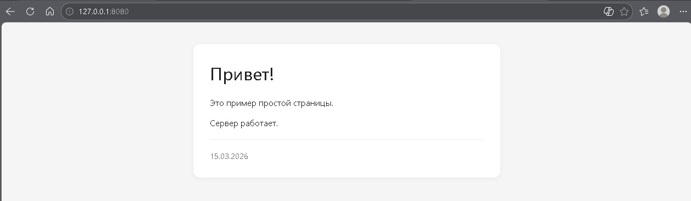

##  CactusHTTP
### Описание:
Это простой Web сервер написанный на Java. Он умеет принимать несколько подключений одновременно. Может обрабатывать и отвечать на простые запросы от клиентов. Он может применятся для создания простых статичных сайтов. Например он может быть полезен, чтобы раздавать файлы или размешать страницы для клуба, с полезной информацией для вашего хоби, и подобные страницы без анимации и скриптов.

### Как собрать jar из исходников
 - Перейти в папку с проектом
 - javac -d out\production\Server src\*.java
 - jar.exe -cvfm CactusHTTP.jar src\META-INF\MANIFEST.MF -C out\production\Server .

### Как запустить (Quick Start)
 - Перейти в папку с проектом
 - Создать файл Data\parparameters.txt (Пример содержимого ниже)
 - java -jar CactusHTTP.jar

### Пример использовния
**Настройки:**
```
Port:8080
Default file:index.html
Default directory:C:\Users\ilia2\Downloads\Server_v2\Server_jar\GermySpaceEnginers
```

**Пример Файл для запуска**
```
//Используется для запуска
cmd /k java -jar Server.jar 
cmd /k CLS 
```

**Пример сайта**




### Проверка работы
После запуска сервера откройте браузер и перейдите по адресу:
`http://localhost:8080`

Вы должны увидеть страницу приветствия или список файлов из папки `ExampleSite` (или той, что указана в настройках).

### Что тут происходит
Это мой давний проект написанный еще в школьные годы. Сейчас идет некоторое переосмысление моего пути, так что я взял один из своих старых проектов, чтобы его привести к не которому "витринному" виду. Тут не стоит цель сделать хороший продукт, просто закончить начатое. Так что ругать без полезно, я скорее всего далеко не сразу пойму о чем идет речь.
%% P.S. Хоть я так и говорю, любые рекомендации будут прочитаны и осмыслены. %%

### Внимание
Проект сырой. Он может быть не безопасен с точки зрения кибербезопасности.

### Планы на ближайшие будущие
Этот проект будет в ближайшие время дорабатывается. 
- [x] Основная и первичная цель привести, то что есть к "витринному" виду. Чтобы его можно было хотя бы скачать и протестировать и он запустился. 
- [ ] Будет проведена работа по тестированию и оформлению самого кода.
- [ ] Будет проведена работа по улучшению функциональности